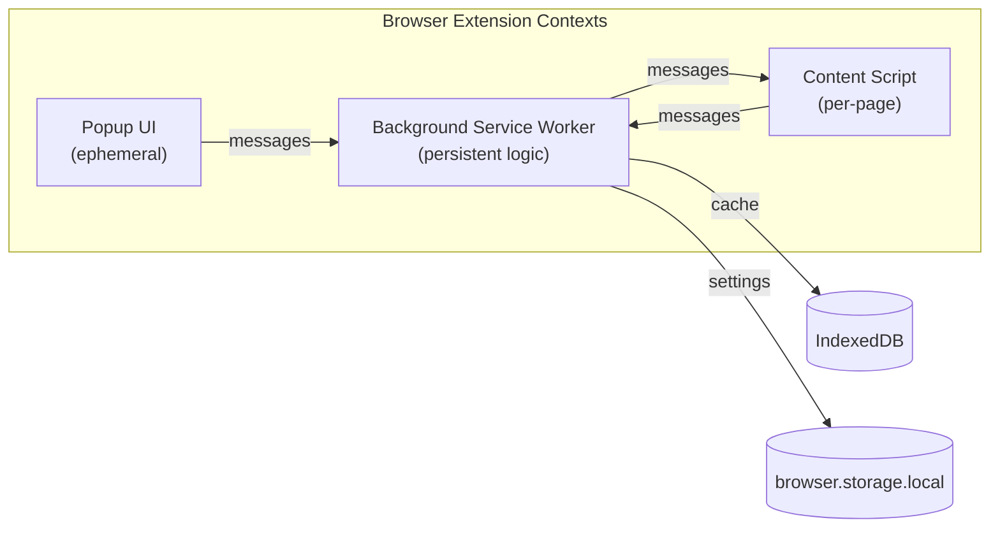
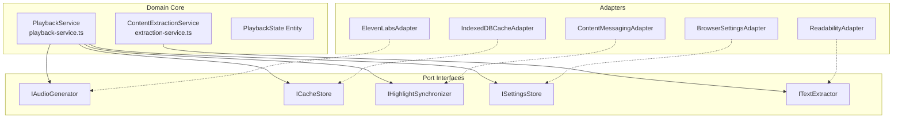
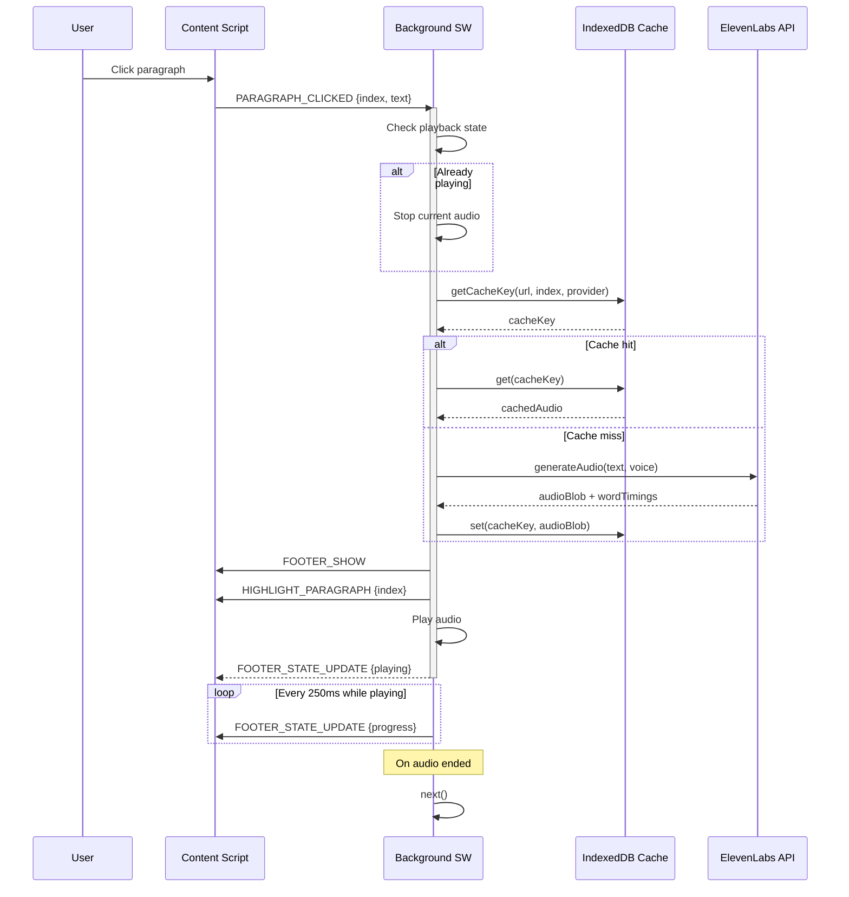
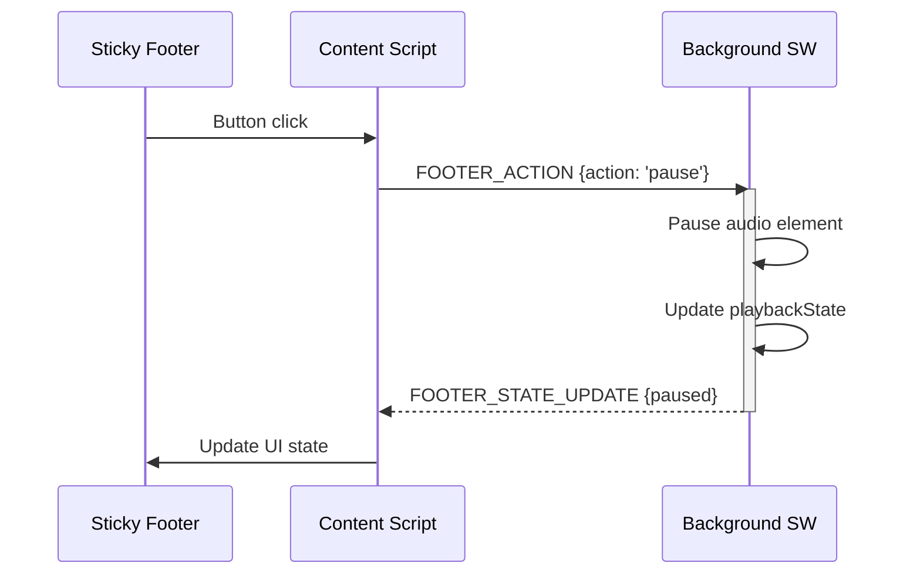
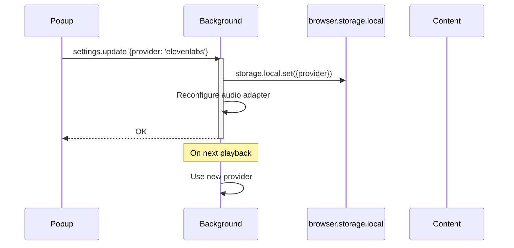
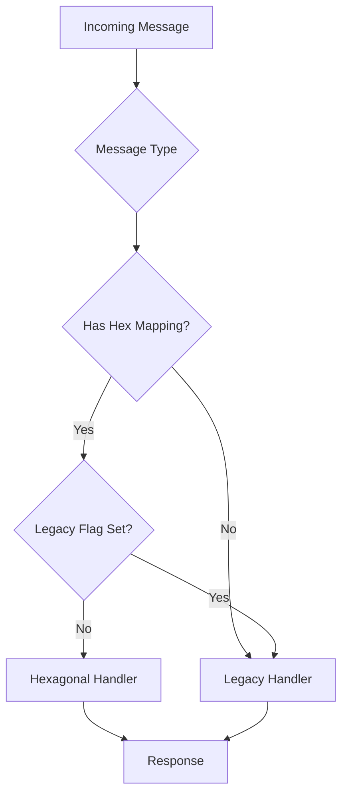

# Proso Current Architecture

**Last Updated**: 2026-01-20
**Feature Branch**: `047-architecture-ui-polish`

This document describes Proso's current architecture, enabling developers to understand message flows and state ownership within 10 minutes.

---

## Overview

Proso is a Firefox browser extension for text-to-speech (TTS) with three main execution contexts:



---

## Context Responsibilities

### Background Service Worker (`src/entrypoints/background.ts`)

**Size**: 2,371 LOC | **Role**: Central orchestrator

The background script is the "brain" of Proso:
- **State Ownership**: Playback state, API keys, audio cache
- **TTS Generation**: Calls ElevenLabs API, manages audio cache
- **Message Routing**: Handles 60+ message types via Strangler Fig pattern
- **Prefetch**: Pre-generates audio for upcoming paragraphs

Key state variables:
```typescript
playbackState: {
  status: 'stopped' | 'loading' | 'playing' | 'paused';
  currentParagraph: number;
  totalParagraphs: number;
  progress: number;
  speed: number;
  provider: string;
  voice: string | null;
}
```

### Content Script (`src/entrypoints/content.ts`)

**Size**: 1,744 LOC | **Role**: Page interaction

The content script runs in every web page:
- **Text Extraction**: Extracts article content via Readability
- **Paragraph Highlighting**: Highlights current paragraph during playback
- **Sticky Footer**: Renders floating playback controls
- **Selection Mode**: Allows clicking paragraphs to start playback

Key components:
- `StickyFooter`: Shadow DOM-based playback controls
- `HighlightManager`: CSS-based paragraph/word highlighting
- `ParagraphSelector`: Click-to-play interaction

### Popup UI (`src/entrypoints/popup/`)

**Size**: ~500 LOC | **Role**: User controls

Ephemeral UI that opens on toolbar icon click:
- Provider/voice selection
- Playback controls (when active)
- Mode selection (article, selection, full)

---

## Hexagonal Architecture (~90% Complete)

Proso follows hexagonal (ports & adapters) architecture:



### Port Interfaces (10 total)

| Port | File | Purpose |
|------|------|---------|
| `IAudioGenerator` | `audio-generator.port.ts` | TTS audio generation |
| `IAudioUrlProvider` | `audio-url.port.ts` | Blob URL management |
| `ICacheStore` | `cache-store.port.ts` | Audio caching |
| `IHighlightSynchronizer` | `highlight-sync.port.ts` | Paragraph highlighting |
| `ISettingsStore` | `settings-store.port.ts` | User preferences |
| `ITextExtractor` | `text-extractor.port.ts` | Content extraction |
| `IContentScorer` | `content-scorer.port.ts` | Content quality scoring |
| `IReader` | `reader.port.ts` | Article parsing |
| `IHighlightRepository` | `highlight-repository.port.ts` | Persistent highlights |
| `IAudioPlayer` | `audio-player.port.ts` | Audio playback |

### Dependency Injection (`src/composition/container.ts`)

Single composition root that wires adapters to services:

```typescript
const container = createContainer(config, apiKeys);
// container.services.playback: PlaybackService
// container.services.contentExtraction: ContentExtractionService
```

---

## Message Flow Diagrams

### Paragraph Click to Playback

The most common flow: user clicks a paragraph, TTS plays.



### Footer Action to Playback Control

User interacts with sticky footer controls.



### Settings Update Flow

User changes provider in popup.



---

## Handler Registry (12 files)

Message handlers are organized by domain:

| Handler File | Messages Handled | Description |
|--------------|------------------|-------------|
| `playback.handlers.ts` | `playback.*` | Play, pause, stop, seek |
| `audio.handlers.ts` | `audio.*` | Voice generation, voice list |
| `cache.handlers.ts` | `cache.*` | Cache stats, clear, evict |
| `settings.handlers.ts` | `settings.*` | Get/set preferences |
| `footer.handlers.ts` | `footer.*` | Footer show/hide/state |
| `provider.handlers.ts` | `provider.*` | Provider list, validation |
| `prefetch.handlers.ts` | `prefetch.*` | Audio pre-generation |
| `queue.handlers.ts` | `queue.*` | Reading queue management |
| `content.handlers.ts` | Content messages | Extraction, highlighting |
| `reader.handlers.ts` | `reader.*` | Article extraction |
| `highlight.handlers.ts` | `highlight.*` | Persistent highlights |
| `debug.handlers.ts` | `hexagonal.*` | Debug/migration status |

---

## State Ownership Summary

| State | Owner | Storage | Shared Via |
|-------|-------|---------|------------|
| Playback status | Background | Memory | `FOOTER_STATE_UPDATE` messages |
| Current paragraph | Background | Memory | Messages |
| Word timings | Background | Memory | Messages |
| Audio cache | Background | IndexedDB | Cache key lookup |
| Settings | Background | browser.storage.local | `settings.get` response |
| API keys | Background | browser.storage.local | Never shared |
| Footer visibility | Content | Memory | Messages from Background |
| DOM highlights | Content | DOM | CSS classes |

---

## Strangler Fig Migration

The codebase uses Strangler Fig pattern for incremental migration:



**Migration Flags** (in `browser.storage.local`):
- `USE_LEGACY_PLAYBACK: true` - Playback handlers use legacy code
- `USE_LEGACY_AUDIO: false` - Audio handlers use hexagonal
- `USE_LEGACY_SETTINGS: false` - Settings handlers use hexagonal
- `USE_LEGACY_CACHE: false` - Cache handlers use hexagonal
- `USE_LEGACY_QUEUE: false` - Queue handlers use hexagonal

---

## Key Files Reference

| Purpose | File | Lines |
|---------|------|-------|
| Background entrypoint | `src/entrypoints/background.ts` | 2,371 |
| Content entrypoint | `src/entrypoints/content.ts` | 1,744 |
| DI Container | `src/composition/container.ts` | 272 |
| PlaybackService | `src/core/playback/playback-service.ts` | 497 |
| Sticky Footer | `src/utils/content/sticky-footer.ts` | 1,426 |
| Cache Store | `src/utils/cache/audio-cache-store.ts` | 450 |
| Cache Key | `src/utils/cache/cache-key.ts` | 206 |

---

## Next Steps

See [findings.md](./findings.md) for architecture smells identified during this analysis.
See [proposed.md](./proposed.md) for proposed hexagonal boundary improvements.
