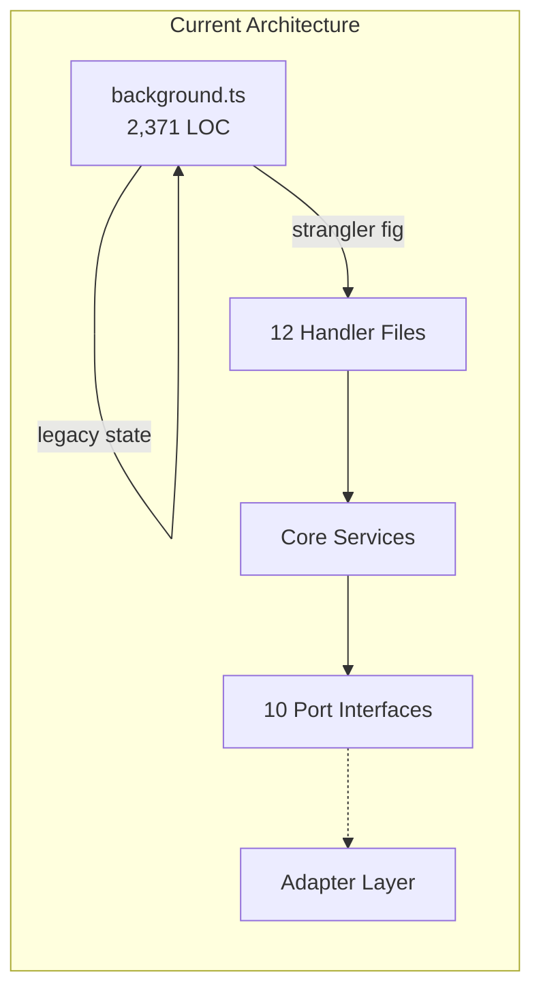
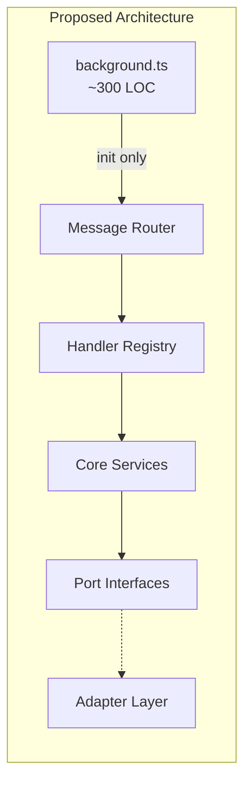

# Proposed Hexagonal Boundaries

**Last Updated**: 2026-01-20
**Feature Branch**: `047-architecture-ui-polish`

This document proposes refined hexagonal architecture boundaries to address the smells identified in [findings.md](./findings.md).

---

## Current vs Proposed Architecture

### Current State (~90% Hexagonal)



**Issues**:
- background.ts still owns playback state
- Duplicate PlaybackState interfaces
- Legacy handlers bypass hexagonal layer

### Proposed State (100% Hexagonal)



**Benefits**:
- background.ts becomes thin orchestrator
- Single source of truth for state
- All messages route through hexagonal handlers

---

## Interface Definitions

### IAudioProvider Interface

```typescript
/**
 * Port interface for TTS audio generation.
 * Implementations: ElevenLabsAdapter, BrowserTTSAdapter (future)
 *
 * @module ports/audio-generator.port
 */
export interface IAudioGenerator {
  /**
   * Generate audio from text.
   *
   * @param request - Audio generation request
   * @returns Result containing audio blob and metadata
   */
  generateAudio(request: AudioRequest): Promise<Result<AudioResponse, AudioError>>;

  /**
   * Get available voices for this provider.
   */
  getVoices(): Promise<Result<Voice[], AudioError>>;

  /**
   * Check if provider is available (has valid credentials).
   */
  isAvailable(): boolean;

  /**
   * Provider identifier.
   */
  readonly providerId: ProviderId;
}

export interface AudioRequest {
  readonly text: string;
  readonly voice: string | null;
  readonly speed: number;
  readonly language: string | null;
}

export interface AudioResponse {
  readonly audioBlob: Blob;
  readonly durationMs: number;
  readonly wordTimings?: WordTiming[];
}
```

**Current Location**: `src/ports/audio-generator.port.ts`
**Status**: Implemented

---

### ICacheStore Interface

```typescript
/**
 * Port interface for audio caching.
 * Implementations: IndexedDBCacheAdapter, InMemoryCacheAdapter
 *
 * @module ports/cache-store.port
 */
export interface ICacheStore {
  /**
   * Get cached audio by key.
   */
  get(key: CacheKey): Promise<Result<CacheEntry | null, CacheError>>;

  /**
   * Store audio in cache.
   */
  set(key: CacheKey, entry: CacheEntry): Promise<Result<void, CacheError>>;

  /**
   * Check if key exists in cache.
   */
  has(key: CacheKey): Promise<boolean>;

  /**
   * Delete entry from cache.
   */
  delete(key: CacheKey): Promise<Result<void, CacheError>>;

  /**
   * Clear all entries.
   */
  clear(): Promise<Result<void, CacheError>>;

  /**
   * Get cache statistics.
   */
  getStats(): Promise<CacheStats>;

  /**
   * Get cached paragraph indices for a URL.
   */
  getCachedParagraphs(url: string, provider?: string, voice?: string): Promise<number[]>;

  /**
   * Evict entries to free space.
   */
  evict(targetSizeBytes: number): Promise<Result<number, CacheError>>;
}

export interface CacheKey {
  readonly urlHash: string;
  readonly paragraphIndex: number;
  readonly provider: string;
  readonly voice: string;
  readonly contentHash: string;
}

export interface CacheEntry {
  readonly audioBlob: Blob;
  readonly durationMs: number;
  readonly wordTimings?: WordTiming[];
  readonly createdAt: number;
  readonly lastAccessedAt: number;
  readonly accessCount: number;
  readonly sizeBytes: number;
}
```

**Current Location**: `src/ports/cache-store.port.ts`
**Status**: Implemented

---

### IPlaybackController Interface (Proposed)

```typescript
/**
 * Port interface for playback control.
 * This would extract playback orchestration from background.ts.
 *
 * @module ports/playback-controller.port (proposed)
 */
export interface IPlaybackController {
  /**
   * Start playback from extracted paragraphs.
   */
  start(
    paragraphs: readonly string[],
    tabId: number,
    pageUrl: string
  ): Promise<Result<PlaybackState, PlaybackError>>;

  /**
   * Pause current playback.
   */
  pause(): Promise<Result<PlaybackState, PlaybackError>>;

  /**
   * Resume paused playback.
   */
  resume(): Promise<Result<PlaybackState, PlaybackError>>;

  /**
   * Stop playback and reset.
   */
  stop(): Promise<Result<PlaybackState, PlaybackError>>;

  /**
   * Move to next paragraph.
   */
  next(): Promise<Result<PlaybackState, PlaybackError>>;

  /**
   * Move to previous paragraph.
   */
  previous(): Promise<Result<PlaybackState, PlaybackError>>;

  /**
   * Seek to specific paragraph.
   */
  seekToParagraph(index: number): Promise<Result<PlaybackState, PlaybackError>>;

  /**
   * Update playback speed.
   */
  setSpeed(speed: number): Promise<Result<PlaybackState, PlaybackError>>;

  /**
   * Get current state.
   */
  getState(): PlaybackState;

  /**
   * Subscribe to state changes.
   */
  subscribe(callback: (state: PlaybackState) => void): () => void;
}
```

**Current Location**: Not yet extracted
**Status**: Proposed - functionality exists in `PlaybackService` but interface not formalized

---

### IContentExtractor Interface

```typescript
/**
 * Port interface for content extraction.
 * Implementations: ReadabilityAdapter
 *
 * @module ports/text-extractor.port
 */
export interface ITextExtractor {
  /**
   * Extract readable content from HTML.
   *
   * @param html - Raw HTML string
   * @param url - Page URL for context
   * @returns Extracted content with paragraphs
   */
  extract(html: string, url: string): Result<ExtractedContent, ExtractionError>;

  /**
   * Check if content can be extracted from URL.
   */
  canExtract(url: string): boolean;
}

export interface ExtractedContent {
  readonly title: string;
  readonly byline: string | null;
  readonly content: string;
  readonly paragraphs: readonly string[];
  readonly textContent: string;
  readonly length: number;
  readonly excerpt: string | null;
}
```

**Current Location**: `src/ports/text-extractor.port.ts`
**Status**: Implemented

---

## Migration Steps

### Phase 1: Unify PlaybackState (Low Risk)

1. Update `src/entrypoints/background.ts` to import `PlaybackState` from core:
   ```typescript
   import { PlaybackState, initialPlaybackState } from '../core/playback/playback-state';
   ```

2. Add missing fields to core type if needed (`currentTime`, `totalTime`)

3. Remove duplicate interface from background.ts

**Effort**: ~1 hour
**Risk**: Low - type-only change

---

### Phase 2: Extract Prefetch Service (Medium Risk)

1. Create `src/services/prefetch-service.ts`:
   - Move prefetch logic from background.ts
   - Inject `IAudioGenerator` and `ICacheStore`
   - Expose `startPrefetch(paragraphs, startIndex)` API

2. Update background.ts to use new service

**Effort**: ~4 hours
**Risk**: Medium - requires careful state management

---

### Phase 3: Connect PlaybackService (High Risk)

1. Wire `PlaybackService` to actual audio playback:
   - Replace `MIGRATION_FLAGS.USE_LEGACY_PLAYBACK = true` with `false`
   - Ensure all state updates flow through service

2. Update handlers to use service methods

3. Remove legacy playback code from background.ts

**Effort**: ~8 hours
**Risk**: High - core functionality change

---

### Phase 4: Thin Background Entry (Low Risk)

After phases 1-3, background.ts should only contain:
- `defineBackground()` setup
- Message listener registration
- Initialization logic

Target: <500 LOC

---

## Testing Strategy

### Unit Tests for Each Port

Each port interface should have:
1. Contract tests verifying adapter compliance
2. Mock implementations for service testing
3. Edge case coverage

Example test structure:
```
tests/
├── contract/
│   ├── audio-generator.contract.test.ts
│   ├── cache-store.contract.test.ts
│   └── text-extractor.contract.test.ts
├── unit/
│   └── cache/
│       └── cache-key.test.ts
```

### Integration Tests

Test complete flows through hexagonal layers:
- Paragraph click → audio generation → playback
- Settings update → provider reconfiguration
- Cache hit vs miss scenarios

---

## Research References

- [Mermaid Diagrams](../research/mermaid-diagrams.md) - Diagram syntax reference
- [Cache Key Derivation](../research/cache-key-derivation.md) - Key format documentation
- [CSS Design Tokens](../research/css-design-tokens.md) - Token naming conventions
- [Footer Accessibility](../research/footer-accessibility.md) - WCAG compliance requirements

---

## Notes

- All proposals are incremental - no big-bang rewrites
- Strangler Fig pattern continues to enable gradual migration
- Test coverage should increase before each migration phase
