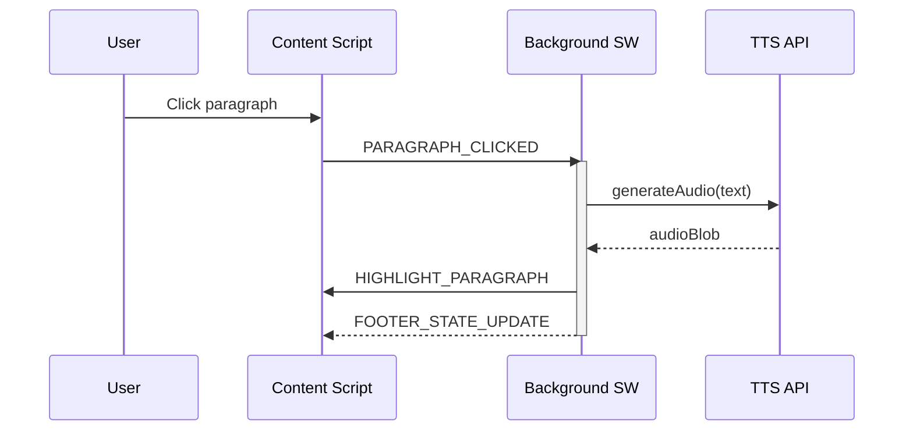
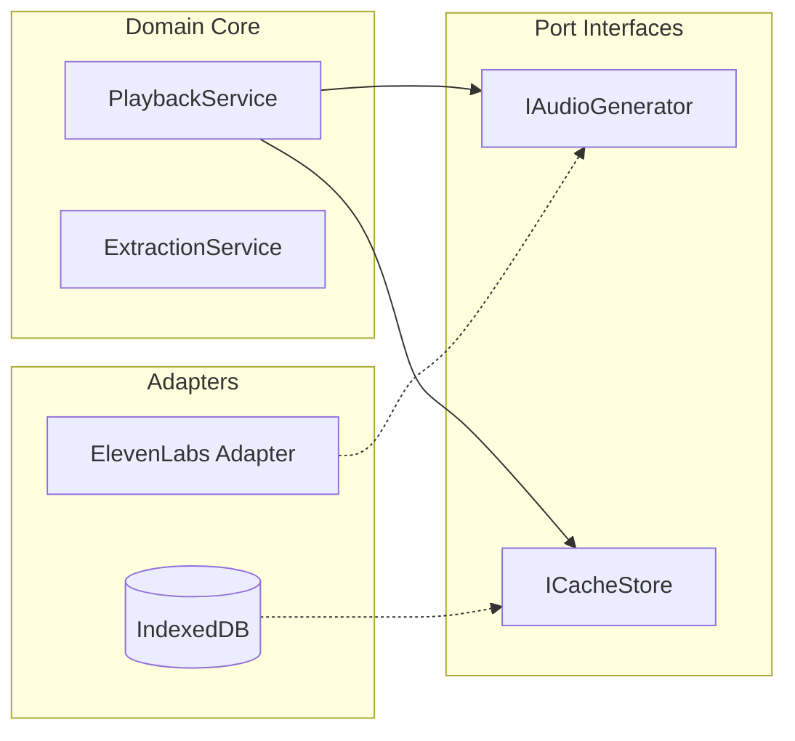

# Mermaid Diagrams for Architecture Documentation

**Last Updated**: 2026-01-20
**Feature Branch**: `047-architecture-ui-polish`

## Decision

Use Mermaid sequence diagrams for message flows and flowcharts for dependency diagrams. GitHub renders Mermaid natively in markdown files.

---

## Rationale

- GitHub supports Mermaid without additional tooling
- Text-based diagrams are version-controlled alongside code
- Mermaid supports all required diagram types (sequence, flowchart, class)

---

## Options Considered

| Option | Pros | Cons |
|--------|------|------|
| **Mermaid** | GitHub native, version-controlled | Limited styling |
| PlantUML | More diagram types | Requires server/plugin |
| Draw.io | Visual editor | Binary files, merge conflicts |
| ASCII diagrams | Universal | Hard to maintain |

**Choice**: Mermaid - best balance of features and GitHub integration.

---

## Sequence Diagrams

Use for message flows between extension contexts.

### Basic Syntax

```
sequenceDiagram
    participant A
    participant B
    A->>B: Synchronous message
    A-)B: Async message
    B-->>A: Response
```

### Message Types

| Syntax | Meaning |
|--------|---------|
| `->>` | Solid line, solid arrowhead (sync call) |
| `-->>` | Dotted line, solid arrowhead (return) |
| `-)` | Solid line, open arrowhead (async) |
| `--)` | Dotted line, open arrowhead (async return) |

### Activation

```
activate Background
... operations ...
deactivate Background
```

### Example: Paragraph Click Flow



---

## Flowcharts

Use for architecture layers and decision flows.

### Basic Syntax

```
flowchart LR
    A[Rectangle] --> B{Diamond}
    B -->|Yes| C[(Database)]
    B -->|No| D((Circle))
```

### Node Shapes

| Syntax | Shape |
|--------|-------|
| `[text]` | Rectangle |
| `(text)` | Rounded rectangle |
| `{text}` | Diamond (decision) |
| `[(text)]` | Database cylinder |
| `((text))` | Circle |
| `>text]` | Flag/banner |

### Direction

| Code | Direction |
|------|-----------|
| `TB` | Top to bottom |
| `LR` | Left to right |
| `BT` | Bottom to top |
| `RL` | Right to left |

### Subgraphs

```
flowchart LR
    subgraph Core[Domain Core]
        Service1
        Service2
    end

    subgraph Adapters
        Adapter1
        Adapter2
    end

    Service1 --> Adapter1
```

### Example: Hexagonal Architecture



---

## Common Pitfalls

### 1. Reserved Word "end"

```
%% BAD: "end" is reserved
A --> end

%% GOOD: Quote or capitalize
A --> "end"
A --> End
```

### 2. Special Characters

```
%% Use HTML entities for special chars
A[Method#40;#41;]  %% Displays as Method()
B[Item #amp; Thing] %% Displays as Item & Thing
```

### 3. Edge Modifiers

```
A ---o B   %% Circle endpoint
A ---x B   %% Cross endpoint
A <--> B   %% Bidirectional
```

### 4. GitHub Limitations

- FontAwesome icons may not render
- Theme colors are GitHub-controlled
- Max diagram size ~50KB

---

## Best Practices

1. **Keep diagrams focused** - One concept per diagram
2. **Use subgraphs** - Group related nodes
3. **Add comments** - `%% Comment text`
4. **Name participants descriptively** - `participant BG as Background`
5. **Use consistent direction** - LR for architecture, TB for flows

---

## Sources

- [Mermaid Official Documentation](https://mermaid.ai/open-source)
- [GitHub Docs: Creating Diagrams](https://docs.github.com/en/get-started/writing-on-github/working-with-advanced-formatting/creating-diagrams)
- [Mermaid Sequence Diagram Docs](https://mermaid.ai/open-source/syntax/sequenceDiagram.html)
- [Mermaid Flowchart Docs](https://mermaid.ai/open-source/syntax/flowchart.html)
